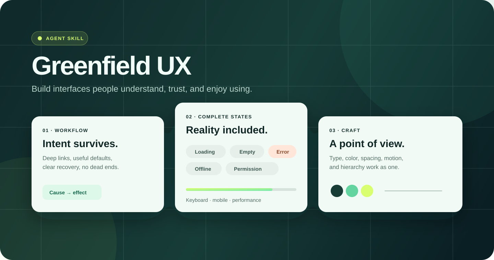
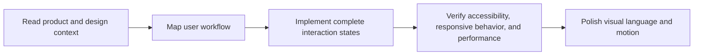

<div align="center">



# Greenfield UX

**An agent skill for building product interfaces that feel considered, complete, and ready to ship.**

[](LICENSE)
[](https://skills.sh/)
[](skills/greenfield-ux/SKILL.md)

</div>

Greenfield UX gives coding agents a practical product-design operating system. It combines workflow quality, accessibility, responsive behavior, complete states, performance, and visual craft in one reusable skill.

## Install

```bash
npx -y skills add https://github.com/size12font/greenfield-ux --skill greenfield-ux -g -a '*' -y --copy
```

The command uses the [skills.sh](https://skills.sh/) installer and copies `skills/greenfield-ux/SKILL.md` to supported coding agents.

## Use it

Ask your agent in plain language:

```text
Use Greenfield UX to redesign this onboarding flow and implement the result.
```

Codex:

```text
$greenfield-ux Review this settings page. Fix workflow, accessibility, and responsive issues.
```

Claude Code and tools with slash-command support:

```text
/greenfield-ux Build a polished empty state and first-run experience.
```

## What it changes

Greenfield UX pushes agents beyond attractive screenshots toward working product quality:

- **Workflow first** — preserve intent, deep-link meaningful state, and remove dead ends.
- **Every state designed** — loading, empty, error, offline, permission, sparse, and dense.
- **Accessible by default** — semantic controls, keyboard support, focus behavior, and useful labels.
- **Responsive by behavior** — adapt the workflow, not only the layout.
- **Fast by perception** — stable layout, intentional feedback, and no avoidable flicker.
- **Visually coherent** — deliberate type, color, spacing, motion, iconography, and hierarchy.
- **Production-minded** — real interactions, edge cases, acceptance criteria, and implementation in the existing stack.

## How it works



## Repository layout

| Path | Purpose |
| --- | --- |
| [`skills/greenfield-ux/SKILL.md`](skills/greenfield-ux/SKILL.md) | Canonical Agent Skill definition |
| [`greenfield_ux.md`](greenfield_ux.md) | Portable single-file reference |
| [`commands/`](commands/) | Slash-command and Gemini CLI formats |
| [`install.sh`](install.sh) | Optional installer for command files and extra agent locations |
| [`uninstall.sh`](uninstall.sh) | Cleanup for the optional installer |

## Optional command installer

Use this only when you also want the repository's command files copied into tools that support them:

```bash
curl -fsSL https://raw.githubusercontent.com/size12font/greenfield-ux/main/install.sh | bash
```

To remove those files later:

```bash
./uninstall.sh
```

## Contributing

Issues and focused pull requests are welcome. See [CONTRIBUTING.md](CONTRIBUTING.md) before changing the canonical skill or installers.

## License and attribution

Apache License 2.0. Greenfield UX includes adapted guidance from Anthropic's `frontend-design` skill; see [NOTICE](NOTICE).
